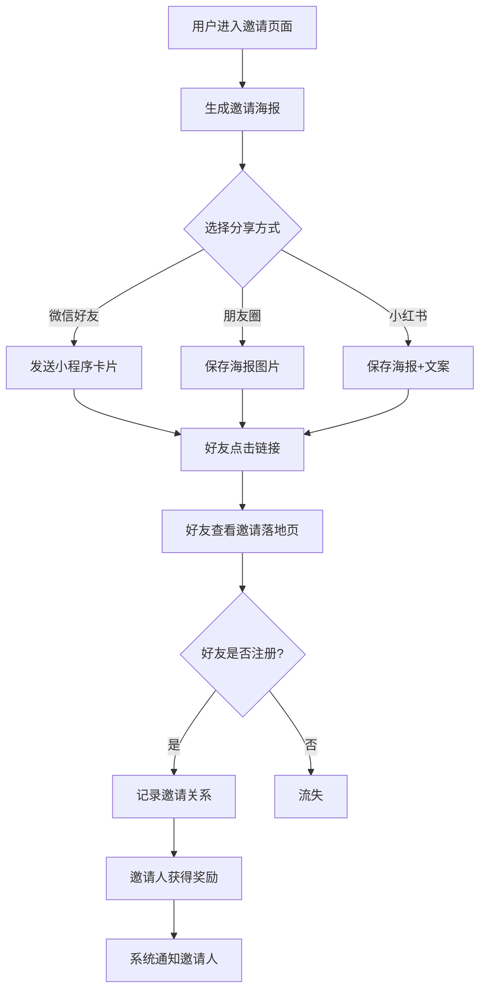
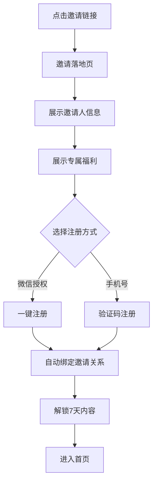
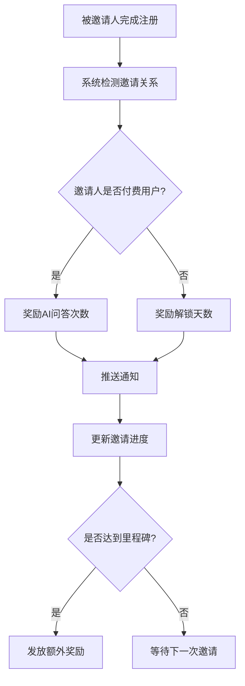

# PetMate 邀请好友系统 产品规格文档 (PRD)

> **文档版本:** v1.0
> **创建日期:** 2026-05-03
> **负责人:** Product Team
> **状态:** 草稿

---

## 一、文档概述

### 1.1 版本记录

| 版本 | 日期 | 作者 | 变更说明 |
|------|------|------|----------|
| v1.0 | 2026-05-03 | Product Team | 初稿 |

### 1.2 相关文档

- 《PetMate 增长黑客方案》
- 《PetMate 数据埋点清单》

---

## 二、需求背景

### 2.1 业务背景

PetMate 是一款帮助新手养猫用户的90天行动指南产品。当前产品主要通过小红书内容获客，用户增长依赖单一渠道，获客成本较高。

**核心问题：**
- 日新增用户约40人，增长缓慢
- K因子（病毒系数）仅0.8，未形成有效裂变
- 付费转化率3.5%，低于行业平均水平

### 2.2 用户痛点

| 用户类型 | 痛点描述 |
|----------|----------|
| 新用户 | 只能免费体验前3天内容，无法全面了解产品价值 |
| 活跃用户 | 想要解锁更多内容但付费意愿不强 |
| 付费用户 | AI问答次数不足，希望获得更多使用额度 |

### 2.3 产品目标

**核心目标：** 建立有效的用户邀请裂变机制，实现用户自发增长。

**量化指标：**

| 指标 | 当前值 | 目标值（8周后） |
|------|--------|-----------------|
| K因子 | 0.8 | 1.2 |
| 日新增用户 | 40 | 120 |
| 邀请回流率 | 20% | 40% |
| 人均邀请人数 | 0.6 | 1.5 |

---

## 三、用户故事

### 3.1 核心用户画像

**画像A：养猫新手小美**
- 年龄：28岁，城市白领
- 场景：刚接猫，焦虑不知道怎么养
- 动机：想解锁更多行动卡内容，但不确定产品是否值得付费
- 行为：愿意分享给同样养猫的朋友，换取免费天数

**画像B：资深猫奴老张**
- 年龄：35岁，养猫3年
- 场景：朋友刚接猫，向他请教
- 动机：自己已经付费，想获得更多AI问答次数
- 行为：主动邀请朋友使用产品

### 3.2 用户故事列表

#### 故事1：生成邀请链接
**作为** 想要邀请好友的用户
**我希望** 能生成专属邀请链接/海报
**以便于** 分享给养猫的朋友

**验收标准：**
- [ ] 用户可一键生成带唯一邀请码的链接
- [ ] 支持生成可保存的邀请海报
- [ ] 海报包含：用户昵称、邀请码二维码、产品核心价值文案

#### 故事2：查看邀请进度
**作为** 已邀请好友的用户
**我希望** 能看到邀请进度和奖励状态
**以便于** 了解还需要邀请多少人才能获得奖励

**验收标准：**
- [ ] 显示已邀请人数和成功注册人数
- [ ] 显示进度条：已邀请X人，再邀请Y人解锁奖励
- [ ] 显示每个被邀请人的状态（已注册/已完成Day1）

#### 故事3：获得邀请奖励
**作为** 成功邀请好友的用户
**我希望** 自动获得对应奖励
**以便于** 无需手动领取即可使用

**验收标准：**
- [ ] 被邀请人完成注册后，邀请人立即获得奖励
- [ ] 奖励发放有系统通知提醒
- [ ] 显示奖励明细：获得X天使用权/Y次AI问答

#### 故事4：被邀请人获得新手福利
**作为** 通过邀请链接注册的新用户
**我希望** 获得专属新用户福利
**以便于** 有更强的注册动力

**验收标准：**
- [ ] 通过邀请链接注册可解锁前7天内容（普通注册仅3天）
- [ ] 注册成功后提示："你是XXX邀请的好友，已解锁7天行动卡"
- [ ] 显示邀请人昵称和头像

#### 故事5：分享邀请记录
**作为** 已邀请多人的用户
**我希望** 能查看邀请历史记录
**以便于** 了解整体邀请情况

**验收标准：**
- [ ] 按时间倒序展示邀请记录
- [ ] 显示被邀请人昵称（脱敏）、注册时间、奖励状态
- [ ] 支持按月筛选

#### 故事6：社交比较激励
**作为** 活跃用户
**我希望** 看到好友的进度
**以便于** 产生社交压力和动力

**验收标准：**
- [ ] 邀请人可看到被邀请人的学习进度（如"Day 15"）
- [ ] 显示邀请排行榜（本周/本月）
- [ ] 排行榜展示TOP 10，自己排名高亮

---

## 四、功能详情

### 4.1 功能架构

```
邀请好友系统
├── 邀请入口
│   ├── 个人中心入口
│   ├── 任务完成引导
│   └── 分享卡片入口
├── 邀请生成
│   ├── 专属邀请码
│   ├── 邀请链接
│   └── 邀请海报
├── 邀请追踪
│   ├── 链接点击追踪
│   ├── 注册归因
│   └── 奖励结算
├── 邀请管理
│   ├── 邀请进度
│   ├── 邀请记录
│   └── 奖励明细
└── 社交激励
    ├── 好友进度
    ├── 排行榜
    └── 成就徽章
```

### 4.2 奖励规则设计

#### 4.2.1 邀请人奖励

| 条件 | 奖励 | 说明 |
|------|------|------|
| 邀请1人注册 | 解锁1天内容 | 免费用户专属 |
| 邀请1人完成Day1 | +3次AI问答 | 付费用户额外奖励 |
| 累计邀请3人 | 解锁完整90天（限时） | 活动期间有效 |
| 累计邀请5人 | 解锁"风险判断高级版" | 特殊功能奖励 |
| 累计邀请10人 | 获得官方周边 | 实物奖励 |

#### 4.2.2 被邀请人奖励

| 条件 | 奖励 | 说明 |
|------|------|------|
| 通过邀请链接注册 | 解锁前7天 | 普通注册仅3天 |
| 完成Day3 | 获得3次AI问答体验 | 引导深度使用 |
| 完成Day7 | 获得优惠券（付费95折） | 促进转化 |

#### 4.2.3 奖励限制规则

- 每日邀请上限：10人/天（防止刷量）
- 同一设备/手机号仅能被邀请一次
- 奖励发放延迟：被邀请人完成注册后即时到账
- 恶意邀请（同一IP批量注册）不发放奖励

### 4.3 邀请码设计

**邀请码格式：** 6位字母数字组合（如：`PM8K2X`）

**规则：**
- 用户注册成功后自动分配唯一邀请码
- 邀请码永久有效，不可更改
- 邀请链接格式：`https://petmate.app/invite?code=PM8K2X`

### 4.4 邀请海报设计

**海报内容要素：**
1. 用户昵称 + 头像
2. 个性化邀请文案（可从文案库选择）
3. 产品核心价值（如"90天新手养猫行动指南"）
4. 邀请码二维码
5. 被邀请人福利说明（"扫码注册送7天"）
6. PetMate品牌Logo

**文案库示例：**
- "我刚接猫，这个90天行动指南超实用，分享给你~"
- "新手养猫别焦虑，按这个做就行！"
- "每天一个养猫小任务，30天后猫咪会主动蹭你~"

---

## 五、用户流程

### 5.1 邀请流程



### 5.2 被邀请人注册流程



### 5.3 奖励结算流程



---

## 六、界面设计要求

### 6.1 页面清单

| 页面名称 | 路由 | 说明 |
|----------|------|------|
| 邀请中心 | `/invite` | 邀请功能入口页面 |
| 邀请海报 | `/invite/poster` | 生成分享海报 |
| 邀请记录 | `/invite/records` | 查看邀请历史 |
| 邀请排行榜 | `/invite/rank` | 邀请达人排行 |
| 邀请落地页 | `/invite/landing?code=XXX` | 新用户看到的邀请页 |

### 6.2 核心页面设计

#### 6.2.1 邀请中心页

**布局结构：**
```
┌─────────────────────────────┐
│       [返回]   邀请好友      │
├─────────────────────────────┤
│                             │
│    ┌───────────────────┐    │
│    │   邀请进度卡片     │    │
│    │ [=====>    ] 1/3   │    │
│    │ 再邀请2人解锁90天  │    │
│    └───────────────────┘    │
│                             │
│    ┌───────────────────┐    │
│    │  立即邀请好友按钮  │    │
│    └───────────────────┘    │
│                             │
│    我的邀请码：PM8K2X       │
│    [复制链接]  [生成海报]    │
│                             │
├─────────────────────────────┤
│    已邀请好友 (3人)          │
│    ┌─────────────────────┐  │
│    │ 👤 小红  Day 15  ✓  │  │
│    │ 👤 小明  Day 7   ✓  │  │
│    │ 👤 小花  刚注册     │  │
│    └─────────────────────┘  │
│                             │
├─────────────────────────────┤
│    本周邀请达人              │
│    🥇 小王 - 12人           │
│    🥈 小李 - 8人            │
│    🥉 你 - 3人              │
│    查看完整榜单 >            │
└─────────────────────────────┘
```

#### 6.2.2 邀请落地页

**布局结构：**
```
┌─────────────────────────────┐
│                             │
│    [产品Logo + 插图]         │
│                             │
│    90天新手养猫行动指南       │
│    每天1个任务，科学养猫      │
│                             │
│    ┌─────────────────────┐  │
│    │  👤 小美邀请你来     │  │
│    │  新用户专属福利：    │  │
│    │  🎁 解锁7天行动卡    │  │
│    │  (普通注册仅3天)     │  │
│    └─────────────────────┘  │
│                             │
│    ┌─────────────────────┐  │
│    │  [微信一键登录]      │  │
│    └─────────────────────┘  │
│    ┌─────────────────────┐  │
│    │  [手机号注册]        │  │
│    └─────────────────────┘  │
│                             │
│    已有账号？直接登录 >       │
│                             │
│    注册即同意《用户协议》     │
└─────────────────────────────┘
```

### 6.3 交互细节

#### 6.3.1 邀请按钮点击

1. 点击"立即邀请好友"
2. 弹出分享面板（微信好友/朋友圈/保存图片/复制链接）
3. 选择后执行对应操作
4. 操作成功后显示toast提示

#### 6.3.2 邀请码复制

1. 点击邀请码区域
2. 自动复制到剪贴板
3. 显示toast："邀请码已复制"

#### 6.3.3 进度条动画

1. 奖励获得时进度条平滑增长
2. 达成里程碑时弹出庆祝动画
3. 显示获得的奖励内容

---

## 七、数据埋点

### 7.1 核心事件

| 事件名 | 触发时机 | 关键参数 |
|--------|----------|----------|
| `invite_page_view` | 进入邀请中心 | user_id, invite_code, total_invites |
| `invite_click` | 点击邀请按钮 | user_id, share_type(link/poster/qrcode) |
| `invite_share_success` | 分享成功 | user_id, platform(wechat/xiaohongshu) |
| `invite_landing_view` | 打开邀请落地页 | invite_code, referrer_id, channel |
| `invite_register` | 通过邀请注册 | user_id, referrer_id, invite_code |
| `invite_reward` | 奖励发放 | user_id, referrer_id, reward_type, reward_amount |
| `invite_poster_save` | 保存邀请海报 | user_id |

### 7.2 漏斗分析

```
邀请页访问 → 点击邀请 → 分享成功 → 好友点击 → 好友注册 → 奖励发放
    100%       40%        30%        15%        10%       10%
```

### 7.3 监控看板指标

| 指标 | 计算公式 | 更新频率 |
|------|----------|----------|
| 邀请页访问UV | count(distinct user_id) where event=invite_page_view | 实时 |
| 邀请点击率 | invite_click / invite_page_view | 每小时 |
| 分享成功率 | invite_share_success / invite_click | 每小时 |
| 邀请转化率 | invite_register / invite_landing_view | 每小时 |
| K因子 | invite_register / invite_page_view | 每天 |
| 人均邀请人数 | count(invite_register) / count(distinct referrer_id) | 每天 |

---

## 八、技术实现要求

### 8.1 数据模型

#### 8.1.1 邀请关系表 (user_invitations)

| 字段 | 类型 | 说明 |
|------|------|------|
| id | bigint | 主键 |
| referrer_id | bigint | 邀请人ID |
| invitee_id | bigint | 被邀请人ID |
| invite_code | varchar(10) | 邀请码 |
| channel | varchar(20) | 邀请渠道 |
| status | tinyint | 状态(0-待注册,1-已注册,2-已奖励) |
| reward_amount | int | 奖励数量 |
| created_at | datetime | 创建时间 |
| updated_at | datetime | 更新时间 |

#### 8.1.2 邀请码表 (invite_codes)

| 字段 | 类型 | 说明 |
|------|------|------|
| id | bigint | 主键 |
| user_id | bigint | 用户ID |
| code | varchar(10) | 邀请码 |
| total_invites | int | 累计邀请人数 |
| successful_invites | int | 成功邀请人数 |
| created_at | datetime | 创建时间 |

#### 8.1.3 邀请奖励表 (invite_rewards)

| 字段 | 类型 | 说明 |
|------|------|------|
| id | bigint | 主键 |
| user_id | bigint | 用户ID |
| referrer_id | bigint | 邀请人ID(为空表示自己是邀请人) |
| reward_type | varchar(20) | 奖励类型 |
| reward_amount | int | 奖励数量 |
| status | tinyint | 状态(0-待发放,1-已发放) |
| created_at | datetime | 创建时间 |

### 8.2 接口设计

#### 8.2.1 获取邀请信息

```
GET /api/v1/invite/info

Response:
{
  "code": "PM8K2X",
  "link": "https://petmate.app/invite?code=PM8K2X",
  "total_invites": 3,
  "successful_invites": 2,
  "pending_reward": 1,
  "milestone_progress": {
    "current": 3,
    "target": 5,
    "reward": "解锁风险判断高级版"
  },
  "invited_users": [
    {
      "nickname": "小红",
      "avatar": "https://...",
      "day_progress": 15,
      "status": "active"
    }
  ]
}
```

#### 8.2.2 生成邀请海报

```
POST /api/v1/invite/poster

Request:
{
  "template_id": "default",
  "custom_text": "刚接猫必看！"
}

Response:
{
  "poster_url": "https://.../invite_poster_xxx.png",
  "expires_at": "2026-05-04T00:00:00Z"
}
```

#### 8.2.3 验证邀请码

```
POST /api/v1/invite/verify

Request:
{
  "code": "PM8K2X"
}

Response:
{
  "valid": true,
  "referrer": {
    "nickname": "小美",
    "avatar": "https://..."
  },
  "reward": "解锁前7天行动卡"
}
```

### 8.3 性能要求

| 接口 | 响应时间 | QPS |
|------|----------|-----|
| 获取邀请信息 | < 100ms | 100 |
| 生成邀请海报 | < 500ms | 20 |
| 验证邀请码 | < 50ms | 200 |

### 8.4 安全要求

1. 邀请链接有效期：永久有效（除非用户注销）
2. 防刷机制：
   - 同一设备ID仅能被邀请一次
   - 同一手机号仅能被邀请一次
   - 同一IP每小时最多接受10次邀请注册
3. 数据脱敏：被邀请人昵称显示首字+***

---

## 九、验收标准

### 9.1 功能验收

| 功能点 | 验收标准 | 优先级 |
|--------|----------|--------|
| 生成邀请码 | 用户注册后自动生成唯一6位邀请码 | P0 |
| 邀请链接分享 | 支持微信好友、朋友圈分享 | P0 |
| 邀请海报生成 | 海报包含用户信息、二维码、福利说明 | P0 |
| 邀请进度展示 | 实时显示邀请人数和距离下一奖励差距 | P0 |
| 奖励自动发放 | 被邀请人注册成功后自动发放奖励 | P0 |
| 邀请记录查询 | 按时间倒序展示邀请记录 | P1 |
| 排行榜展示 | 显示本周/本月邀请达人TOP 10 | P1 |
| 好友进度可见 | 显示被邀请人的学习进度 | P2 |

### 9.2 性能验收

| 指标 | 验收标准 |
|------|----------|
| 邀请页首屏加载 | < 1s |
| 海报生成时间 | < 500ms |
| 奖励发放延迟 | < 3s |
| 并发支持 | 支持100人同时生成海报 |

### 9.3 兼容性验收

| 平台 | 版本要求 |
|------|----------|
| 微信小程序 | 基础库 2.20.0+ |
| iOS | iOS 13.0+ |
| Android | Android 8.0+ |

---

## 十、风险与应对

### 10.1 风险列表

| 风险 | 影响 | 概率 | 应对措施 |
|------|------|------|----------|
| 用户刷邀请奖励 | 成本损失 | 中 | 设置每日上限、检测异常IP |
| 邀请海报被平台限流 | 裂变效果下降 | 中 | 提供10+模板、鼓励原创内容 |
| 被邀请人质量低 | 付费转化率下降 | 低 | 设置门槛（完成Day1才计为有效） |
| 系统高峰期性能问题 | 用户体验下降 | 低 | 海报生成服务独立部署 |

### 10.2 灰度发布计划

| 阶段 | 比例 | 时长 | 观察指标 |
|------|------|------|----------|
| 小流量测试 | 5%用户 | 3天 | 功能稳定性、邀请转化率 |
| 中流量测试 | 20%用户 | 5天 | K因子、用户反馈 |
| 全量发布 | 100%用户 | - | 核心指标达标 |

---

## 十一、里程碑计划

| 阶段 | 时间 | 交付物 |
|------|------|--------|
| 设计评审 | Week 1 | UI设计稿、技术方案 |
| 开发完成 | Week 2 | 功能开发、单元测试 |
| 测试验收 | Week 3 | 功能测试、性能测试 |
| 灰度发布 | Week 4 | 灰度上线、数据监控 |
| 正式上线 | Week 5 | 全量发布、运营推广 |

---

## 十二、附录

### 12.1 名词解释

| 名词 | 定义 |
|------|------|
| K因子 | 病毒系数，平均每个用户能带来的新用户数 |
| 邀请回流率 | 被邀请人完成注册的比例 |
| 有效邀请 | 被邀请人完成注册且激活（完成Day1） |

### 12.2 参考资料

- [微信小程序分享API文档](https://developers.weixin.qq.com/miniprogram/dev/api/share/wx.updateShareMenu.html)
- [增长黑客实战指南]

---

**文档结束**

> 本文档为产品规格文档，如有疑问请联系产品负责人。
